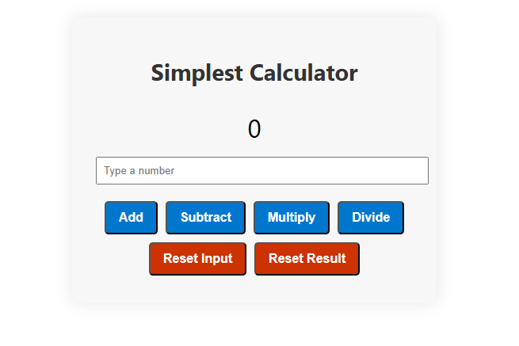

# Calculator – Coursera Project

This project was built as part of the **React Basics** course on Coursera. Its goal is to demonstrate foundational React skills by building a simple and functional calculator app.

## Screenshot



## Project Overview

The app allows users to perform basic arithmetic operations (addition, subtraction, multiplication, division) with a clean, responsive UI built in React. It was designed to showcase state handling, event binding, and component-based architecture.

## Technologies Used

- React 19.1.0
- React DOM
- React Scripts
- Testing Library (Jest, React, User Event)
- JavaScript & CSS
- HTML (via JSX)

## Installation & Setup

# Clone the repo

```bash
git clone https://github.com/maitepv87/calculator-coursera.git
```

# Navigate into the folder

```bash
cd calculator-coursera
```

# Install dependencies

```bash
npm install
```

# Start the app

```bash
npm start
```

## Purpose

This calculator was created to fulfill the final assignment of the React Basics course on Coursera and help earn course certification. While simple, it represents practical usage of hooks like useState, handling user input, and rendering dynamic UI updates.
